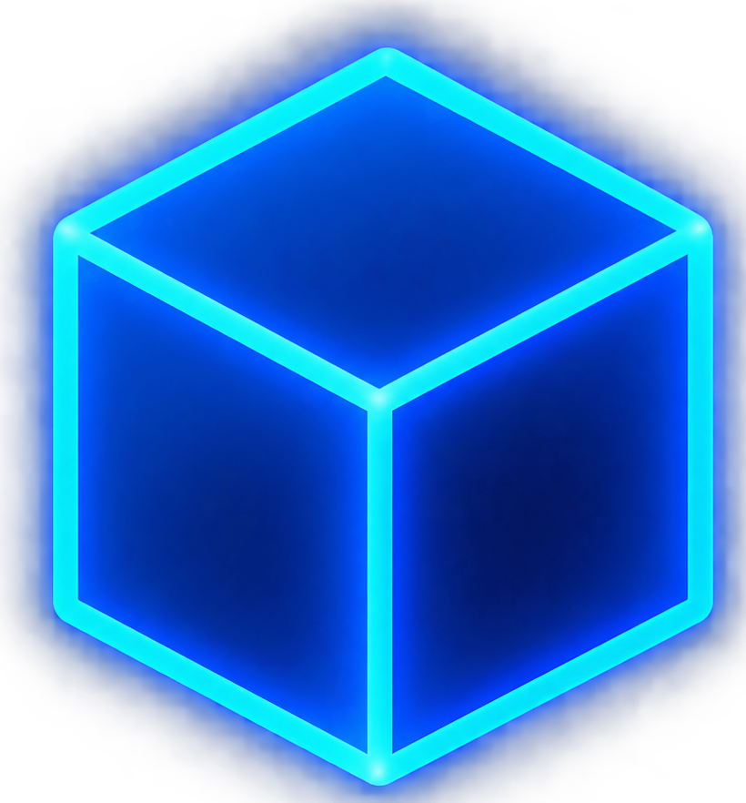

  

  

  
  
  

  

  
  
  

<!-- SOBRE MI-->
<table>
  <tr>
    <td width="62%" valign="top">

<h2>
  
  Sobre mí
</h2>

<b>Profesional en informática, con más de 15 años de experiencia en el área y conocimientos en soporte técnico, hardware, software, electrónica, redes, infraestructura IT, administración de sistemas en entornos Windows y resolución de incidencias técnicas.</b>

<b>Actualmente desarrollo proyectos y herramientas en Python orientados a la automatización, análisis técnico, utilidades de sistemas y redes, ciberseguridad e inteligencia artificial, manteniendo un aprendizaje constante y explorando nuevas tecnologías y soluciones aplicadas al área IT.</b>

<b>A través de ORS4TECH, comparto parte de estos conocimientos, proyectos y experiencias mediante contenido educativo sobre informática, Python, ciberseguridad, inteligencia artificial y otras tecnologías.</b>

<b>Me interesa seguir aprendiendo y conectar con personas del área tecnológica para compartir conocimientos, colaborar en proyectos y generar nuevas conexiones profesionales.</b>

</td>

<!--ENFOQUE TECNICO -->
<td width="38%" valign="top">

<h2>Enfoque técnico</h2>

 

 

 

 

 

</td>
</tr>
</table>

<!-- PROYECTOS Y HERRAMIENTAS -->
<table width="100%" cellpadding="10" cellspacing="0">
<tr>
<td>

<strong>Proyectos y herramientas</strong> 
Herramientas y proyectos propios desarrollados principalmente en Python, orientados a sistemas, automatización, redes, análisis técnico y ciberseguridad.

 

</td>
</tr>
</table>

<!--  TECNOLOGIAS USADAS -->

  <h2>Tecnologías presentes en mis proyectos</h2>

  

    Lenguajes, herramientas, formatos y recursos que utilizo en mis proyectos personales, scripts y utilidades orientadas a sistemas, automatización y análisis técnico.
  

  

  

  

  

  

  

  

  

  

  

  

  

  

