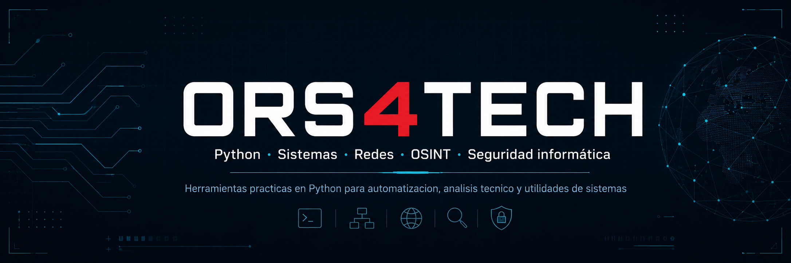

  

  

  

  

  

  

<!-- SOBRE MI-->
<table>
  <tr>
    <td width="62%" valign="top">

<h2>Sobre mí</h2>

<b>Profesional en informática</b>, con experiencia práctica en <b>soporte técnico, hardware, software, redes, infraestructura IT, administración de sistemas en entornos Windows y resolución de incidencias técnicas</b>.

Como parte de mi crecimiento técnico, desarrollo herramientas en <b>Python</b> orientadas a <b>automatización, análisis de información, utilidades de sistemas, redes, OSINT y seguridad informática</b>, aplicadas a escenarios reales del área IT.

Me interesa construir soluciones útiles, seguir aprendiendo y conectar con personas del área tecnológica para compartir conocimientos, colaborar en proyectos y generar nuevas conexiones profesionales.

También gestiono <b>ORS4TECH</b>, un espacio donde comparto contenido educativo sobre informática, Python, ciberseguridad, inteligencia artificial y buenas prácticas tecnológicas.

</td>

<td width="38%" valign="top">

<h2>Enfoque técnico</h2>

  

  

  

  

  

</td>
</tr>
</table>

<!--  TECNOLOGIAS USADAS -->

  <h2>Tecnologías presentes en mis proyectos</h2>

  

    Lenguajes, herramientas, formatos y recursos que utilizo en mis proyectos personales, scripts y utilidades orientadas a sistemas, automatización y análisis técnico.
  

  

  

  

  

  

  

  

  

  

  

  

  

  

